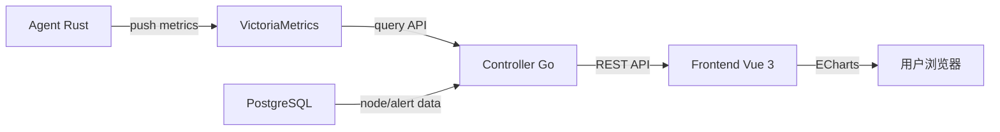
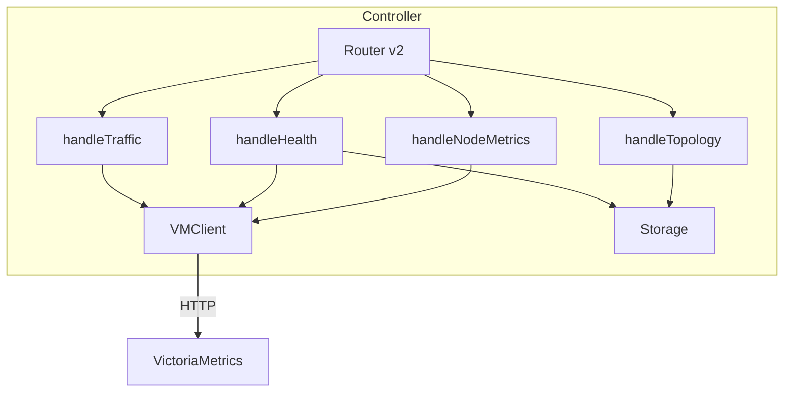

# 设计文档：Dashboard 真实数据接入

## 概述

本设计将 Aria SD-WAN 管理平台的 Dashboard、节点详情和 VPN Topology 三个核心页面从 mock 数据切换到真实后端 API 数据。核心变更包括：

1. **后端**：新增 VictoriaMetrics 查询客户端（`pkg/victoriametrics`），新增 3 个 API handler（Traffic、Health、Topology），扩展 1 个已有 handler（Node Metrics）
2. **前端**：改造 Dashboard.vue（流量图表 + 统计卡片 + 健康指标）、改造 Nodes.vue 详情弹窗（带宽/延迟）、完整实现 VpnTopology.vue

数据流：Agent (Rust) → Prometheus metrics → VictoriaMetrics → Controller (Go) → REST API → Frontend (Vue 3)

## 架构

### 整体数据流



### 新增后端组件



### 路由扩展

在已有的 `handleTenantMonitoring` 路由分发中新增 4 个端点：

| 方法 | 路径 | Handler | 数据源 |
|------|------|---------|--------|
| GET | `/monitoring/traffic` | handleMonitoringTraffic | VictoriaMetrics |
| GET | `/monitoring/health` | handleMonitoringHealth | PostgreSQL + VictoriaMetrics |
| GET | `/monitoring/nodes/{node_id}/metrics` | handleMonitoringNodeMetrics | VictoriaMetrics |
| GET | `/monitoring/topology` | handleMonitoringTopology | PostgreSQL |

## 组件与接口

### 1. VictoriaMetrics 查询客户端

新增 `pkg/victoriametrics/client.go`，封装对 VictoriaMetrics HTTP API 的查询。

```go
// pkg/victoriametrics/client.go
package victoriametrics

type Client struct {
    baseURL    string
    httpClient *http.Client
}

// NewClient 创建 VM 查询客户端
// baseURL 示例: "http://localhost:8428"
func NewClient(baseURL string) *Client

// QueryRange 执行范围查询
// 对应 VictoriaMetrics /api/v1/query_range
func (c *Client) QueryRange(ctx context.Context, query string, start, end time.Time, step time.Duration) (*QueryRangeResult, error)

// QueryInstant 执行即时查询
// 对应 VictoriaMetrics /api/v1/query
func (c *Client) QueryInstant(ctx context.Context, query string) (*QueryInstantResult, error)
```

**设计决策**：
- 使用标准库 `net/http` 而非引入第三方 Prometheus client 库，保持依赖最小化
- 查询超时 10 秒，通过 `context.WithTimeout` 控制
- baseURL 从 Controller 配置的 `metrics.push_gateway` 字段推导（去掉 `/api/v1/import/prometheus` 后缀）

### 2. Traffic API

```
GET /api/v2/tenants/{tenant_id}/monitoring/traffic?range=24h
```

**查询参数**：
- `range`：时间范围，枚举值 `1h | 24h | 7d | 30d`，默认 `24h`

**响应格式**：
```json
{
  "success": true,
  "data": {
    "timestamps": [1700000000, 1700003600, ...],
    "upload_bytes": [1024000, 2048000, ...],
    "download_bytes": [2048000, 4096000, ...],
    "peak_bandwidth_mbps": 125.5
  },
  "message": "Traffic data retrieved"
}
```

**实现逻辑**：
1. 获取租户下所有节点的 public_key 列表（用于 metrics label 过滤）
2. 构建 PromQL：`sum(rate(wireguard_total_tx_bytes{instance=~"node1|node2"}[5m]))` 
3. 调用 `VMClient.QueryRange()` 获取时序数据
4. 计算 peak_bandwidth_mbps 作为时序中的最大值

**step 策略**：
| range | step |
|-------|------|
| 1h | 60s |
| 24h | 300s (5min) |
| 7d | 1800s (30min) |
| 30d | 7200s (2h) |

### 3. Health API

```
GET /api/v2/tenants/{tenant_id}/monitoring/health
```

**响应格式**：
```json
{
  "success": true,
  "data": {
    "node_online_rate": 85.7,
    "sync_success_rate": 92.3,
    "active_alerts_count": 3,
    "failed_commands_count": 1
  },
  "message": "Health data retrieved"
}
```

**实现逻辑**：
- `node_online_rate`：复用 `CountNodesByTenantAndStatus()`，计算 `online / total * 100`
- `sync_success_rate`：复用 `CalcSyncSuccessRate()`
- `active_alerts_count`：复用 `CountActiveAlerts()`
- `failed_commands_count`：复用 `CountFailedCommandsByTenant()`

**设计决策**：Health API 主要聚合已有的 PostgreSQL 查询，不依赖 VictoriaMetrics，确保即使 VM 不可用也能返回基本健康数据。

### 4. Node Metrics API

```
GET /api/v2/tenants/{tenant_id}/monitoring/nodes/{node_id}/metrics
```

**响应格式**：
```json
{
  "success": true,
  "data": {
    "upload_mbps": 45.2,
    "download_mbps": 78.6,
    "latency_ms": 12.5
  },
  "message": "Node metrics retrieved"
}
```

**实现逻辑**：
1. 验证 node_id 属于该租户
2. 获取节点的 peer 标识（public_key 前 16 字符，与 Agent metrics.rs 中的 `peer_id` 一致）
3. 查询 `wireguard_peer_rx_bytes{peer="<peer_id>"}` 和 `wireguard_peer_tx_bytes{peer="<peer_id>"}`
4. 使用 `rate()` 函数计算最近 5 分钟的速率，转换为 Mbps
5. 查询 `wireguard_peer_last_handshake_secs{peer="<peer_id>"}` 作为延迟参考

### 5. Topology API

```
GET /api/v2/tenants/{tenant_id}/monitoring/topology
```

**响应格式**：
```json
{
  "success": true,
  "data": {
    "nodes": [
      {
        "id": "uuid",
        "hostname": "node-1",
        "region": "cn",
        "status": "online",
        "assigned_ip": "100.64.0.1"
      }
    ],
    "links": [
      {
        "source": "uuid-1",
        "target": "uuid-2",
        "status": "active"
      }
    ]
  },
  "message": "Topology data retrieved"
}
```

**实现逻辑**：
1. 获取租户下所有非 deleted 节点
2. 构建全连接 peer 关系（WireGuard mesh 网络中每个节点与其他所有节点互为 peer）
3. 连接状态判定：如果两端节点都 online 则 `active`，否则 `inactive`

### 6. 前端组件改造

#### Dashboard.vue 改造
- 统计卡片：从 `useTenantApi.getTenantNodes()` + `useMonitorApi.getStats()` + 新增 `getTraffic()` 获取真实数据
- 流量图表：调用 Traffic API，按 `timeRange` 切换时重新请求
- 健康指标：调用 Health API，替换硬编码的 CPU/Memory/Disk/Latency 为 node_online_rate / sync_success_rate / active_alerts / failed_commands
- 活动列表：调用已有的 `getEvents()` API
- 区域分布：从节点列表按 region 聚合计算
- 自动刷新：60 秒定时器刷新健康指标
- 趋势百分比：移除硬编码的 "+12%"、"+5%" 等，无历史数据时隐藏

#### useMonitorApi.js 扩展
新增 3 个方法：
```javascript
getTraffic: async (range = '24h') => { ... }
getHealth: async () => { ... }     // 覆盖已有的 getHealth（当前指向 /health）
getNodeMetrics: async (nodeId) => { ... }
getTopology: async () => { ... }
```

#### API_ENDPOINTS 扩展
```javascript
MONITOR: {
  // 已有
  STATS: ..., NODE_DETAIL: ..., EVENTS: ..., ALERTS: ..., ALERT_RESOLVE: ...,
  // 新增
  TRAFFIC: (tenantId) => buildTenantPath(tenantId, '/monitoring/traffic'),
  HEALTH: (tenantId) => buildTenantPath(tenantId, '/monitoring/health'),
  NODE_METRICS: (tenantId, nodeId) => buildTenantPath(tenantId, `/monitoring/nodes/${nodeId}/metrics`),
  TOPOLOGY: (tenantId) => buildTenantPath(tenantId, '/monitoring/topology'),
}
```

#### Nodes.vue 详情弹窗改造
- 打开详情弹窗时，额外调用 `getNodeMetrics(nodeId)` 获取真实带宽/延迟
- 替换 `bandwidth: { upload: 0, download: 0 }` 和 `latency: 0`
- API 失败时显示 "N/A"

#### VpnTopology.vue 完整实现
- 调用 Topology API 获取节点和连接数据
- 使用 ECharts `graph` 类型渲染力导向拓扑图
- 节点颜色：online → 绿色，offline → 红色
- 连接线：active → 绿色实线，inactive → 灰色虚线
- 节点 tooltip：hostname、region、assigned_ip、status
- 连接 tooltip：源节点、目标节点、连接状态
- 空状态：无节点时显示 "暂无节点数据"
- 错误处理：API 失败时显示错误提示

## 数据模型

### VictoriaMetrics 查询响应模型

```go
// pkg/victoriametrics/types.go

// QueryRangeResult 表示 range query 的响应
type QueryRangeResult struct {
    Status string          `json:"status"`
    Data   QueryRangeData  `json:"data"`
}

type QueryRangeData struct {
    ResultType string              `json:"resultType"`
    Result     []RangeResultItem   `json:"result"`
}

type RangeResultItem struct {
    Metric map[string]string `json:"metric"`
    Values [][]interface{}   `json:"values"` // [[timestamp, "value"], ...]
}

// QueryInstantResult 表示 instant query 的响应
type QueryInstantResult struct {
    Status string             `json:"status"`
    Data   QueryInstantData   `json:"data"`
}

type QueryInstantData struct {
    ResultType string               `json:"resultType"`
    Result     []InstantResultItem  `json:"result"`
}

type InstantResultItem struct {
    Metric map[string]string `json:"metric"`
    Value  []interface{}     `json:"value"` // [timestamp, "value"]
}
```

### Topology 响应模型

```go
// 内联在 handler 中，无需独立 struct
type TopologyNode struct {
    ID         string `json:"id"`
    Hostname   string `json:"hostname"`
    Region     string `json:"region"`
    Status     string `json:"status"`
    AssignedIP string `json:"assigned_ip"`
}

type TopologyLink struct {
    Source string `json:"source"`
    Target string `json:"target"`
    Status string `json:"status"` // "active" | "inactive"
}
```

### 前端 Traffic 数据模型

```typescript
interface TrafficData {
  timestamps: number[]
  upload_bytes: number[]
  download_bytes: number[]
  peak_bandwidth_mbps: number
}

interface HealthData {
  node_online_rate: number
  sync_success_rate: number
  active_alerts_count: number
  failed_commands_count: number
}

interface NodeMetrics {
  upload_mbps: number
  download_mbps: number
  latency_ms: number
}

interface TopologyData {
  nodes: TopologyNode[]
  links: TopologyLink[]
}
```

### Controller 配置扩展

无需新增配置字段。VictoriaMetrics 查询地址从已有的 `metrics.push_gateway` 推导：
- 配置值：`http://127.0.0.1:8428/api/v1/import/prometheus`
- 推导查询地址：`http://127.0.0.1:8428`（截取到 host:port）

如果 `metrics.push_gateway` 未配置，默认使用 `http://localhost:8428`。

## 正确性属性（Correctness Properties）

*正确性属性是指在系统所有有效执行中都应成立的特征或行为——本质上是关于系统应该做什么的形式化陈述。属性是人类可读规范与机器可验证正确性保证之间的桥梁。*

### 属性 1：Traffic API 响应结构完整性

*对于任意*有效的时间范围参数（1h、24h、7d、30d），Traffic API 返回的响应应包含 `timestamps`、`upload_bytes`、`download_bytes` 三个等长数组，且 `peak_bandwidth_mbps` 为非负数值。

**验证需求：1.1**

### 属性 2：时间范围参数验证

*对于任意*字符串作为 `range` 查询参数，当且仅当该字符串属于 `{1h, 24h, 7d, 30d}` 集合时，Traffic API 应返回成功响应；否则应返回 400 错误。

**验证需求：1.2**

### 属性 3：PromQL 查询构建正确性

*对于任意*非空的节点标识列表，Traffic API 构建的 PromQL 查询应包含所有且仅包含该列表中的节点标识作为 instance 过滤条件，且使用 `wireguard_total_rx_bytes` 和 `wireguard_total_tx_bytes` 指标名。

**验证需求：1.4**

### 属性 4：健康指标计算正确性

*对于任意*租户的节点状态集合（total 节点数、online 节点数、synced 节点数、active 告警数、failed 命令数），Health API 返回的 `node_online_rate` 应等于 `online / total * 100`（total 为 0 时返回 100），`sync_success_rate`、`active_alerts_count`、`failed_commands_count` 应与底层查询结果一致。

**验证需求：2.1, 2.3**

### 属性 5：统计卡片聚合正确性

*对于任意*节点列表，Dashboard 计算的 `total` 应等于节点数量，`online` 应等于 status 为 online 的节点数量，`routes` 应等于所有节点 `advertised_routes` 长度之和。

**验证需求：3.2**

### 属性 6：峰值带宽为时序最大值

*对于任意*非空的流量时序数据，`peak_bandwidth_mbps` 应等于上传和下载速率时序中的最大值。

**验证需求：3.3**

### 属性 7：字节速率到 Mbps 转换正确性

*对于任意*非负的字节速率值（bytes/sec），转换为 Mbps 的结果应等于 `rate * 8 / 1_000_000`。

**验证需求：4.2**

### 属性 8：拓扑图连接数量正确性

*对于任意* N 个非 deleted 节点的集合（N ≥ 0），Topology API 返回的 links 数量应等于 `N * (N - 1) / 2`，且每条 link 的 source 和 target 都是节点列表中的有效 ID，且 link 的 status 为 "active"（当且仅当两端节点都 online）或 "inactive"。

**验证需求：5.1, 5.2**

### 属性 9：Prometheus 响应解析正确性

*对于任意*有效的 Prometheus JSON 响应（包含 status、data.resultType、data.result 字段），VM Client 的解析结果应保留所有 metric labels 和数值，且序列化后再解析应得到等价结构（round-trip）。

**验证需求：6.3, 6.4**

### 属性 10：租户隔离——查询仅包含本租户节点

*对于任意*两个不同租户及其各自的节点集合，为租户 A 构建的 PromQL 查询中的 instance 过滤列表不应包含租户 B 的任何节点标识，反之亦然。

**验证需求：6.6**

## 错误处理

### 后端错误处理

| 场景 | 处理方式 | HTTP 状态码 |
|------|----------|-------------|
| VictoriaMetrics 不可用 | 返回空数据集，记录 error 日志 | 200（data 为空数组/零值） |
| VictoriaMetrics 查询超时（>10s） | 取消请求，返回空数据集 | 200（data 为空数组/零值） |
| 无效的 range 参数 | 返回错误 | 400 |
| node_id 不属于该租户 | 返回 Not Found | 404 |
| node_id 格式无效 | 返回错误 | 400 |
| 数据库查询失败 | 返回 Internal Server Error | 500 |
| tenant_id 格式无效 | 返回错误（已有中间件处理） | 400 |

### 前端错误处理

| 场景 | 处理方式 |
|------|----------|
| Traffic API 失败 | 显示错误提示，保留上次成功数据 |
| Health API 失败 | System Health 卡片显示"数据不可用" |
| Stats API 失败 | 对应卡片显示 "N/A" |
| Node Metrics API 失败 | 带宽/延迟显示 "N/A" |
| Topology API 失败 | 显示错误提示信息 |
| 租户下无节点 | 拓扑页显示"暂无节点数据"空状态 |

### VictoriaMetrics 降级策略

当 VictoriaMetrics 不可用时：
- Traffic API：返回空时序数据（timestamps/upload_bytes/download_bytes 为空数组，peak_bandwidth_mbps 为 0）
- Health API：仍返回 PostgreSQL 可提供的指标（node_online_rate、sync_success_rate、active_alerts_count、failed_commands_count），不受 VM 影响
- Node Metrics API：返回零值（upload_mbps: 0, download_mbps: 0, latency_ms: 0）

## 测试策略

### 单元测试

单元测试覆盖具体示例、边界条件和错误场景：

**后端（Go）**：
- `pkg/victoriametrics/client_test.go`：使用 `httptest.Server` 模拟 VM 响应，测试 QueryRange/QueryInstant 的正常和异常路径
- `internal/api/v2/monitoring_test.go`：测试新增 handler 的请求解析、响应格式、错误码
- 边界条件：空节点列表、VM 超时、无效 range 参数、node_id 不属于租户

**前端（JavaScript）**：
- `useMonitorApi` 新增方法的请求参数构建
- Dashboard.vue 数据聚合逻辑（统计卡片计算、区域分布聚合）
- VpnTopology.vue 的 ECharts option 构建逻辑

### 属性测试（Property-Based Testing）

使用 Go 的 `testing/quick` 包进行属性测试，每个属性测试至少运行 100 次迭代。

每个属性测试必须通过注释引用设计文档中的属性编号：
- 格式：`// Feature: dashboard-realdata, Property {N}: {属性标题}`

**后端属性测试**：
- **Property 1**：生成随机 range 参数，验证 Traffic API 响应结构
- **Property 2**：生成随机字符串，验证 range 参数校验逻辑
- **Property 3**：生成随机节点标识列表，验证 PromQL 构建
- **Property 4**：生成随机节点计数，验证健康指标计算
- **Property 5**：生成随机节点列表（含随机 routes），验证统计聚合
- **Property 6**：生成随机流量时序，验证峰值计算
- **Property 7**：生成随机字节速率，验证 Mbps 转换
- **Property 8**：生成随机节点集合（0-50 个），验证拓扑 link 数量和状态
- **Property 9**：生成随机 Prometheus JSON 响应，验证解析 round-trip
- **Property 10**：生成两组随机节点集合，验证 PromQL 租户隔离

**前端属性测试**（使用 `fast-check`）：
- 统计卡片聚合逻辑的属性测试
- 字节到可读格式转换的属性测试

### 集成测试

- 使用 `httptest.Server` 模拟 VictoriaMetrics，端到端测试 API handler
- 验证 JWT 中间件的租户隔离（不同 tenant_id 的请求不能访问其他租户数据）

