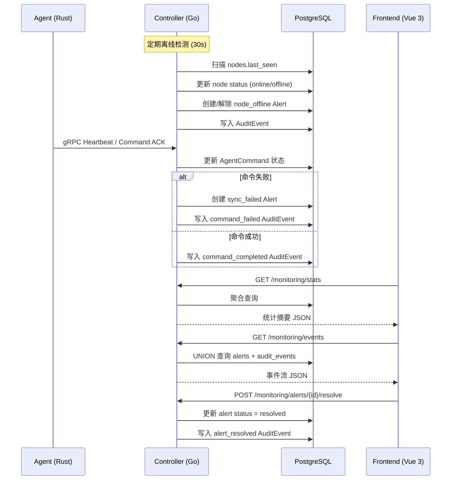

# 设计文档：Monitoring 闭环

## 概述

本设计实现 Aria SD-WAN 的租户级监控闭环功能，将现有 Monitoring 页面从 mock 数据驱动重构为基于 desired / applied / observed 三态模型的事件流/审计式监控视图。

核心目标：
- 新增 `alerts` 和 `audit_events` 两张数据库表，支撑告警与审计事件的存储
- 重构 Monitoring API（`/api/v2/tenants/{tenant_id}/monitoring/`），提供 stats、node detail、events、alerts 四组端点
- 在 Controller 的 cleanup routine 中集成离线检测与告警生成逻辑
- 在 AgentCommand / PolicyDelivery 状态变更路径中嵌入告警和审计事件的写入
- 重构前端 Monitoring.vue，移除所有 mock 数据，接入真实 API

## 架构

### 系统交互流程



### 模块划分

| 模块 | 位置 | 职责 |
|------|------|------|
| Alert Storage | `pkg/controllerstorage/alerts.go` | alerts 表 CRUD |
| AuditEvent Storage | `pkg/controllerstorage/audit_events.go` | audit_events 表 CRUD |
| Monitoring API | `internal/api/v2/monitoring.go` | stats / node detail / events / alerts HTTP handlers |
| Alert Generator | `pkg/controllerstorage/alert_generator.go` | 告警生成与自动解除逻辑 |
| Offline Detector | `internal/cli/controller_serve.go` | 扩展现有 cleanup routine，集成离线检测 |
| Frontend Composable | `frontend/src/composables/useMonitorApi.js` | 扩展 API 调用 hooks |
| Frontend View | `frontend/src/views/Monitoring.vue` | 重构监控页面 |
| Frontend Node Detail | `frontend/src/views/NodeMonitorDetail.vue` | 新增节点监控详情面板 |

## 组件与接口

### 后端 API 接口

所有 API 遵循现有 `v1.WriteSuccess` / `v1.WriteError` 统一响应格式：

```json
{
  "success": true,
  "data": { ... },
  "message": "...",
  "code": "SUCCESS"
}
```

#### 1. GET /api/v2/tenants/{tenant_id}/monitoring/stats

重构现有 `handleTenantMonitoringStats`，返回控制闭环统计摘要。

**响应 data 字段：**

```json
{
  "total_nodes": 10,
  "online_nodes": 8,
  "offline_nodes": 2,
  "sync_success_rate": 87.5,
  "total_peers": 10,
  "total_acl_rules": 15,
  "total_qos_rules": 6,
  "failed_commands_count": 3,
  "active_alerts_count": 2
}
```

#### 2. GET /api/v2/tenants/{tenant_id}/monitoring/nodes/{node_id}

重构现有 `handleTenantMonitoringNodeDetail`，返回节点三态详情和操作历史。

**响应 data 字段：**

```json
{
  "node_id": "uuid",
  "hostname": "worker-01",
  "availability_status": "online",
  "desired_state_version": "dsv-xxx",
  "applied_state_version": "dsv-xxx",
  "observed_state": "applied",
  "observed_message": "",
  "state_convergence": "converged",
  "last_sync_at": "2024-01-15T14:30:00Z",
  "last_sync_error": "",
  "recent_commands": [ ... ],
  "recent_policy_deliveries": [ ... ]
}
```

#### 3. GET /api/v2/tenants/{tenant_id}/monitoring/events

新增端点，返回 Alert + AuditEvent 混合事件流。

**查询参数：** `limit`（默认50，最大200）、`offset`（默认0）、`node_id`、`event_type`、`severity`、`since`（ISO 8601）

**响应 data 字段：**

```json
{
  "items": [
    {
      "id": "uuid",
      "source": "alert",
      "event_type": "node_offline",
      "severity": "critical",
      "node_id": "uuid",
      "title": "节点 worker-01 离线",
      "detail": { "offline_since": 1705312200 },
      "created_at": "2024-01-15T14:30:00Z"
    },
    {
      "id": "uuid",
      "source": "audit",
      "event_type": "command_completed",
      "severity": "",
      "node_id": "uuid",
      "title": "命令 sync 执行成功",
      "detail": { "command_id": "uuid" },
      "created_at": "2024-01-15T14:29:00Z"
    }
  ],
  "total": 120,
  "limit": 50,
  "offset": 0
}
```

#### 4. GET /api/v2/tenants/{tenant_id}/monitoring/alerts

新增端点，返回告警列表。

**查询参数：** `status`（active/resolved/all，默认active）、`alert_type`、`node_id`、`limit`（默认50，最大200）、`offset`（默认0）

#### 5. POST /api/v2/tenants/{tenant_id}/monitoring/alerts/{alert_id}/resolve

新增端点，手动解除告警。

**响应：** 更新后的 alert 对象。

### 后端内部接口

#### AlertStore（`pkg/controllerstorage/alerts.go`）

```go
func (s *Storage) CreateAlert(alert *Alert) (*Alert, error)
func (s *Storage) ResolveAlert(alertID uuid.UUID) (*Alert, error)
func (s *Storage) GetActiveAlertByNodeAndType(tenantID, nodeID uuid.UUID, alertType string) (*Alert, error)
func (s *Storage) ListAlerts(tenantID uuid.UUID, filter AlertFilter) ([]*Alert, int, error)
func (s *Storage) CountActiveAlerts(tenantID uuid.UUID) (int, error)
```

#### AuditEventStore（`pkg/controllerstorage/audit_events.go`）

```go
func (s *Storage) CreateAuditEvent(event *AuditEvent) (*AuditEvent, error)
func (s *Storage) ListAuditEvents(tenantID uuid.UUID, filter AuditEventFilter) ([]*AuditEvent, int, error)
```

#### AlertGenerator（`pkg/controllerstorage/alert_generator.go`）

```go
func (s *Storage) GenerateNodeOfflineAlert(tenantID, nodeID uuid.UUID, hostname string) error
func (s *Storage) ResolveNodeOfflineAlert(tenantID, nodeID uuid.UUID) error
func (s *Storage) GenerateSyncFailedAlert(tenantID, nodeID uuid.UUID, commandID, errorMsg string) error
func (s *Storage) GeneratePolicyFailedAlert(tenantID, nodeID uuid.UUID, domain, ref, errorMsg string) error
```

### 前端组件接口

#### useMonitorApi 扩展

```javascript
// 新增方法
getEvents(params)       // GET /monitoring/events
getAlerts(params)       // GET /monitoring/alerts
resolveAlert(alertId)   // POST /monitoring/alerts/{id}/resolve
getNodeMonitorDetail(nodeId)  // GET /monitoring/nodes/{nodeId}
```

## 数据模型

### alerts 表

```sql
CREATE TABLE IF NOT EXISTS alerts (
    id UUID PRIMARY KEY DEFAULT gen_random_uuid(),
    tenant_id UUID NOT NULL REFERENCES tenants(id),
    node_id UUID REFERENCES nodes(id),
    alert_type VARCHAR(32) NOT NULL,
    severity VARCHAR(16) NOT NULL,
    title VARCHAR(255) NOT NULL,
    message TEXT,
    context JSONB NOT NULL DEFAULT '{}'::jsonb,
    status VARCHAR(16) NOT NULL DEFAULT 'active',
    created_at TIMESTAMPTZ DEFAULT NOW(),
    resolved_at TIMESTAMPTZ
);

CREATE INDEX idx_alerts_tenant_status ON alerts(tenant_id, status);
CREATE INDEX idx_alerts_tenant_node_type ON alerts(tenant_id, node_id, alert_type);
CREATE INDEX idx_alerts_created_at ON alerts(created_at);
```

**字段约束：**
- `alert_type` ∈ {`node_offline`, `sync_failed`, `policy_failed`}
- `severity` ∈ {`critical`, `warning`, `info`}
- `status` ∈ {`active`, `resolved`}

### audit_events 表

```sql
CREATE TABLE IF NOT EXISTS audit_events (
    id UUID PRIMARY KEY DEFAULT gen_random_uuid(),
    tenant_id UUID NOT NULL REFERENCES tenants(id),
    node_id UUID REFERENCES nodes(id),
    event_type VARCHAR(32) NOT NULL,
    actor VARCHAR(128) NOT NULL DEFAULT 'system',
    summary VARCHAR(512) NOT NULL,
    detail JSONB NOT NULL DEFAULT '{}'::jsonb,
    created_at TIMESTAMPTZ DEFAULT NOW()
);

CREATE INDEX idx_audit_events_tenant ON audit_events(tenant_id);
CREATE INDEX idx_audit_events_tenant_node ON audit_events(tenant_id, node_id);
CREATE INDEX idx_audit_events_type ON audit_events(event_type);
CREATE INDEX idx_audit_events_created_at ON audit_events(created_at);
```

**字段约束：**
- `event_type` ∈ {`node_registered`, `node_offline`, `node_online`, `command_queued`, `command_completed`, `command_failed`, `policy_delivered`, `policy_failed`, `alert_created`, `alert_resolved`}
- `actor` 格式：`system` 或 `user:{username}`

### Go 结构体

```go
type Alert struct {
    ID         uuid.UUID              `json:"id"`
    TenantID   uuid.UUID              `json:"tenant_id"`
    NodeID     *uuid.UUID             `json:"node_id,omitempty"`
    AlertType  string                 `json:"alert_type"`
    Severity   string                 `json:"severity"`
    Title      string                 `json:"title"`
    Message    string                 `json:"message"`
    Context    map[string]interface{} `json:"context"`
    Status     string                 `json:"status"`
    CreatedAt  time.Time              `json:"created_at"`
    ResolvedAt *time.Time             `json:"resolved_at,omitempty"`
}

type AlertFilter struct {
    Status    string     // active / resolved / all
    AlertType string     // 可选
    NodeID    *uuid.UUID // 可选
    Limit     int
    Offset    int
}

type AuditEvent struct {
    ID        uuid.UUID              `json:"id"`
    TenantID  uuid.UUID              `json:"tenant_id"`
    NodeID    *uuid.UUID             `json:"node_id,omitempty"`
    EventType string                 `json:"event_type"`
    Actor     string                 `json:"actor"`
    Summary   string                 `json:"summary"`
    Detail    map[string]interface{} `json:"detail"`
    CreatedAt time.Time              `json:"created_at"`
}

type AuditEventFilter struct {
    NodeID    *uuid.UUID
    EventType string
    Since     *time.Time
    Limit     int
    Offset    int
}
```

### 事件流统一格式（EventFeedItem）

用于 `/monitoring/events` 端点返回的混合事件流：

```go
type EventFeedItem struct {
    ID        string                 `json:"id"`
    Source    string                 `json:"source"`     // "alert" | "audit"
    EventType string                `json:"event_type"`
    Severity  string                `json:"severity"`   // Alert 有值，AuditEvent 为 ""
    NodeID    string                `json:"node_id"`
    Title     string                `json:"title"`
    Detail    map[string]interface{} `json:"detail"`
    CreatedAt time.Time              `json:"created_at"`
}
```

### 告警生成嵌入点

| 触发点 | 位置 | 告警类型 |
|--------|------|----------|
| 离线检测 routine | `controller_serve.go` → `cleanupStaleNodes` 扩展 | `node_offline` (create) / `node_offline` (resolve) |
| AgentCommand 状态更新 | `agent_commands.go` → `UpdateAgentCommandStatus` | `sync_failed` |
| PolicyDelivery 状态更新 | 同上（级联更新） | `policy_failed` |

### sync_success_rate 计算逻辑

```sql
SELECT
    COUNT(*) FILTER (WHERE ncs.desired_state_version != '' AND ncs.desired_state_version = ncs.applied_state_version) AS synced,
    COUNT(*) FILTER (WHERE ncs.desired_state_version != '') AS total
FROM node_control_states ncs
JOIN nodes n ON n.id = ncs.node_id
WHERE n.tenant_id = $1
```

`sync_success_rate = CASE WHEN total = 0 THEN 100 ELSE (synced * 100.0 / total) END`


## 正确性属性（Correctness Properties）

*属性（Property）是一种在系统所有合法执行中都应成立的特征或行为——本质上是对系统应做什么的形式化陈述。属性是人类可读规格说明与机器可验证正确性保证之间的桥梁。*

### Property 1: Alert 与 AuditEvent 存储往返一致性

*对于任意* 合法的 Alert 或 AuditEvent 对象，将其写入数据库后再读取，应得到与原始对象等价的记录（所有字段值一致）。

**Validates: Requirements 3.1, 4.1**

### Property 2: sync_success_rate 计算正确性

*对于任意* 一组 NodeControlState 记录，sync_success_rate 应等于 `(desired_state_version == applied_state_version 的记录数) / (desired_state_version 非空的记录数) × 100`；若无 desired_state_version 非空的记录，则 sync_success_rate 应为 100。

**Validates: Requirements 1.2, 1.4**

### Property 3: 节点在线/离线分类正确性

*对于任意* 节点和任意当前时间戳，若 `now - last_seen > 60`，则该节点应被分类为 offline 且 status 应更新为 offline；若 `now - last_seen <= 60`，则应被分类为 online。

**Validates: Requirements 1.3, 9.2**

### Property 4: 离线告警生成

*对于任意* 被检测为离线的节点，若该节点当前不存在 active 状态的 node_offline 告警，则系统应创建一条 severity 为 critical 的 node_offline 告警。

**Validates: Requirements 3.2**

### Property 5: 失败操作告警生成

*对于任意* 状态变更为 failed 的 AgentCommand，系统应创建一条 severity 为 warning 的 sync_failed 告警；*对于任意* command_status 变更为 failed 的 PolicyDelivery，系统应创建一条 severity 为 warning 的 policy_failed 告警，context 中包含相关引用信息。

**Validates: Requirements 3.3, 3.4**

### Property 6: 节点恢复在线时告警自动解除

*对于任意* 从 offline 恢复为 online 的节点，若存在该节点的 active node_offline 告警，则该告警的 status 应被更新为 resolved 且 resolved_at 应被记录。

**Validates: Requirements 3.5, 9.3**

### Property 7: 告警生成幂等性

*对于任意* 已存在 active node_offline 告警的离线节点，再次执行离线检测不应创建重复的 node_offline 告警（同一节点同一类型的 active 告警最多一条）。

**Validates: Requirements 9.4**

### Property 8: 状态变更审计事件生成

*对于任意* AgentCommand 或 PolicyDelivery 的终态变更（completed / failed），以及任意 Alert 的创建或解除，以及任意节点在线状态变化，系统应创建对应类型的 AuditEvent 记录。

**Validates: Requirements 4.2, 4.3, 4.4, 4.5**

### Property 9: 节点详情响应完整性

*对于任意* 属于指定租户的节点，GET /monitoring/nodes/{node_id} 的响应应包含 availability_status、desired_state_version、applied_state_version、observed_state、state_convergence、last_sync_at、last_sync_error 字段。

**Validates: Requirements 2.1**

### Property 10: 历史记录数量限制

*对于任意* 节点详情请求，返回的 recent_commands 不超过 20 条，recent_policy_deliveries 不超过 20 条，且均按 created_at 倒序排列。

**Validates: Requirements 2.2**

### Property 11: 租户隔离

*对于任意* node_id 和 tenant_id 组合，若该 node_id 不属于该 tenant_id，则 API 应返回 HTTP 404 和错误码 NODE_NOT_FOUND。

**Validates: Requirements 2.3**

### Property 12: 事件流时间排序

*对于任意* 事件流查询结果，返回的 items 列表应严格按 created_at 倒序排列（即 items[i].created_at >= items[i+1].created_at）。

**Validates: Requirements 5.1**

### Property 13: 事件流过滤正确性

*对于任意* 事件流查询，若指定了 node_id 过滤参数，则返回的所有事件的 node_id 应等于该参数值；若指定了 event_type，则所有事件的 event_type 应匹配；若指定了 since，则所有事件的 created_at 应晚于该时间戳。

**Validates: Requirements 5.2**

### Property 14: 告警列表默认过滤与过滤正确性

*对于任意* 告警列表查询，若未指定 status 参数或 status 为 "active"，则返回的所有告警的 status 应为 active；若指定了 alert_type，则所有告警的 alert_type 应匹配；若指定了 node_id，则所有告警的 node_id 应匹配。

**Validates: Requirements 6.1, 6.2**

### Property 15: 告警手动解除

*对于任意* active 状态的告警，调用 resolve 端点后，该告警的 status 应变为 resolved，resolved_at 应非空，且应创建一条 alert_resolved 审计事件。

**Validates: Requirements 6.3**

### Property 16: 统计响应字段完整性

*对于任意* 租户的 stats 请求，响应 data 应包含 total_nodes、online_nodes、offline_nodes、sync_success_rate、total_peers、total_acl_rules、total_qos_rules、failed_commands_count、active_alerts_count 全部 9 个字段，且 online_nodes + offline_nodes == total_nodes。

**Validates: Requirements 1.1**

## 错误处理

### API 层错误处理

| 场景 | HTTP 状态码 | 错误码 | 说明 |
|------|------------|--------|------|
| 租户无权限 | 403 | ACCESS_DENIED | JWT 中的 tenant_id 与路径不匹配 |
| 节点不属于租户 | 404 | NODE_NOT_FOUND | tenant isolation |
| 告警不存在 | 404 | ALERT_NOT_FOUND | alert_id 无效或不属于该租户 |
| 告警已解除 | 400 | ALERT_ALREADY_RESOLVED | 重复 resolve |
| 无效查询参数 | 400 | BAD_REQUEST | limit/offset/since 格式错误 |
| 数据库查询失败 | 500 | INTERNAL_ERROR | DB 连接或查询异常 |

### 告警生成错误处理

- 告警写入失败不应阻塞主流程（AgentCommand 状态更新）。告警生成失败时记录 error 日志并继续。
- 审计事件写入失败同理，不阻塞主流程。
- 离线检测 routine 中的错误应记录日志但不中断定时器。

### 数据一致性

- 告警生成使用 `GetActiveAlertByNodeAndType` 先查后写，通过 `(tenant_id, node_id, alert_type)` 索引保证查询效率。
- 在高并发场景下，可能出现短暂的重复告警窗口。可接受，因为告警是辅助信息而非关键路径。

## 测试策略

### 单元测试

使用 Go 标准 `testing` 包，前端使用 Vitest。

**后端单元测试重点：**
- `sync_success_rate` 计算函数：空集合、全匹配、部分匹配、无 desired 版本
- `nodeAvailabilityStatus` 函数：边界值（恰好 60 秒）
- Alert CRUD 操作
- AuditEvent CRUD 操作
- 事件流合并排序逻辑
- 过滤参数解析与应用

**前端单元测试重点：**
- `useMonitorApi` 各方法的请求参数构造
- 事件流渲染组件的 props 处理
- convergence 状态到样式类的映射

### 属性测试（Property-Based Testing）

使用 Go 的 `testing/quick` 包或 `github.com/leanovate/gopter` 库。前端使用 `fast-check`。

**配置要求：**
- 每个属性测试最少运行 100 次迭代
- 每个测试用注释标注对应的设计属性编号

**标注格式：** `// Feature: monitoring-closure, Property {N}: {property_text}`

**属性测试与单元测试互补：**
- 单元测试覆盖具体示例、边界条件和错误场景
- 属性测试覆盖所有输入空间的通用属性
- 两者结合提供全面的正确性保证

**关键属性测试：**
- Property 2（sync_success_rate）：生成随机 NodeControlState 集合，验证计算公式
- Property 3（在线/离线分类）：生成随机 last_seen 和当前时间，验证分类结果
- Property 7（告警幂等性）：生成随机离线节点序列，多次执行检测，验证无重复告警
- Property 12（事件流排序）：生成随机事件集合，验证合并后的排序
- Property 13（事件流过滤）：生成随机事件和过滤参数，验证过滤结果
- Property 16（统计字段完整性）：生成随机租户状态，验证响应字段

每个正确性属性由单个属性测试实现。
