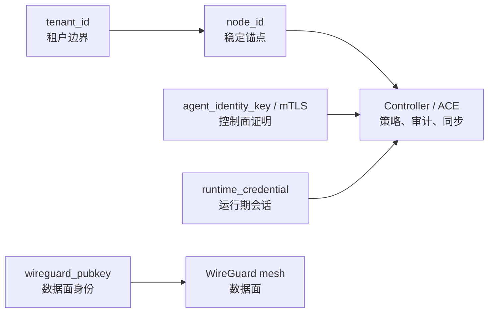
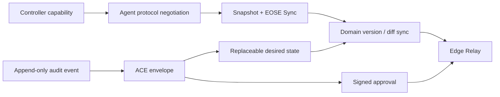

# Aria 控制面事件化与 Nostr 借鉴方案

> 统一整理：身份分层、Nostr 借鉴边界、ACE 事件模型、Sync 语义、工程前置、落地路线图、审查状态。  
> 最后更新：2026-06-06
> 相关：[V0.1.0-PRODUCT-BLUEPRINT.md](./V0.1.0-PRODUCT-BLUEPRINT.md)、[code-review-findings.md](./code-review-findings.md)、[Phase 1 implementation plan](./superpowers/plans/2026-06-03-control-plane-phase1.md)

---

## 1. 结论摘要

| 项 | 结论 |
|----|------|
| 产品定位 | Aria 是多租户 SD-WAN 控制平台，不是去中心化社交协议，也不是公网 Nostr 应用。 |
| Nostr 边界 | 只借鉴签名事件、kind/tags、replaceable、ephemeral、EOSE、capability、challenge、remote signing 等设计语义；不兼容 Nostr wire format，不接公网 relay。 |
| 短期重点 | `controller-info` 能力声明、Sync `snapshot_complete`、`domain_versions`、关键控制变更 append-only 审计。 |
| 中期重点 | ACE（Aria Control Event）信封、replaceable desired state、按 domain version 的 diff/domain snapshot。 |
| 长期重点 | Edge Relay、签名审批、高安全 challenge auth、企业合规回放。 |
| 产品收益 | 让网络变更可证明、可审计、可同步、可回滚、可扩展；提升 Agent/Controller 兼容性和企业信任。 |
| 审查统计 | 62 项：61 fixed / 0 partial / 0 open / 1 wontfix，详见 [§9](#9-审查摘要)。 |

一句话：**Aria 不兼容公网 Nostr，但借鉴 Nostr 的签名事件、可替换状态、能力声明和 relay 思想，把 SD-WAN 控制面升级为可验证、可追溯、可渐进分发的企业控制系统。**

---

## 2. 两套身份

Aria 必须明确区分北向用户身份和南向 Agent 身份。北向解决“哪个人/哪个租户可以操作”；南向解决“哪个节点可以入网、同步、执行命令、应用策略”。

### 2.1 北向：JWT + 租户 + RBAC

| 实体 | 边界 | 说明 |
|------|------|------|
| `tenant_id` | 租户隔离单元 | 所有北向查询、订阅、策略写入必须等价于强制 `tenant_id` filter。 |
| `user_id` | 用户身份 | JWT subject；用户可属于租户，`super_admin` 可通过显式租户上下文切换。 |
| `role` | 租户内角色 | `owner` / `admin` / `operator` / `viewer` / custom roles。 |
| `permissions` | 细粒度动作 | 对应 `nodes:read`、`policies:write`、`monitoring:read` 等能力。 |
| JWT | 用户会话凭据 | 只用于控制台和北向管理 API，不用于 Agent 运行期证明。 |

### 2.2 南向：注册、同步、运行期

| 流程 | 使用凭据 | 目标 |
|------|----------|------|
| 首次注册 | Enrollment Token + bootstrap material | 将未知机器绑定到租户，创建稳定 `node_id`。 |
| 重注册 | Runtime Token / 同租户 enrollment flow / machine proof | 防止节点身份漂移和租户串联。 |
| 周期 Sync | Runtime credential，可叠加 challenge | 拉取 peers、ACL、QoS、routes、证书、命令。 |
| 敏感命令 | Runtime credential + challenge 或 mTLS client cert | 限制高风险操作和高安全租户。 |

### 2.3 南向五层身份

| 层 | 名称 | 用途 | 是否轮换 |
|----|------|------|----------|
| 1 | `node_id` | 平台稳定主键、审计、策略归属、ACE 坐标 | 不轮换 |
| 2 | `tenant_id` | 租户隔离边界 | 不随节点漂移 |
| 3 | `agent_identity_key` / mTLS cert | 南向认证、challenge 签名、证书生命周期 | 可受控轮换 |
| 4 | `wireguard_pubkey` | 数据面隧道 peer 身份 | 可受控轮换 |
| 5 | `runtime_credential` | 短 TTL 运行期会话凭据 | 必须周期刷新 |



关键约束：

- 策略、审计、租户归属永远绑定 `node_id`，不是绑定 WG 公钥。
- `wireguard_pubkey` 是当前数据面材料，轮换必须走受控生命周期事件。
- `runtime_credential` 是短期凭据，必须刷新，不能代替节点长期身份。
- **WireGuard 私钥不承担控制面签名**。challenge 使用 `agent_identity_key` 或 mTLS 客户端证书私钥。

### 2.4 凭据轮换边界

| 凭据 | 当前状态 | 目标 |
|------|----------|------|
| Enrollment Token | 已用于首次入网 | 保持租户绑定入口，避免任意公钥开放写入。 |
| Runtime Token | 已有运行期刷新方向 | 缩短 TTL，绑定 Sync 刷新和高安全 challenge。 |
| mTLS 证书 | 已有签发/续签方向 | 与 Agent 控制面身份协同，支持撤销事件。 |
| WG key | 当前更多是数据面持久材料 | 引入 `wg_key.rotated` 生命周期事件，不承担控制面签名。 |
| `agent_identity_key` | 待产品化 | v0.2 后作为南向 proof 与 challenge signer。 |

---

## 3. Nostr 边界

### 3.1 Nostr 是什么

Nostr 的核心很小：用户 keypair、签名 event、relay、WebSocket pub/sub。NIP-01 里所有数据都以 event 表示，`kind` 区分语义，`tags` 做索引，客户端用 `REQ` filter 订阅，relay 先返回历史匹配事件，再用 EOSE 表示历史快照结束。

### 3.2 Aria 和 Nostr 的差异

| 维度 | Nostr | Aria |
|------|-------|------|
| 身份 | 公钥即主要身份 | `tenant_id` + `node_id` + 用户/RBAC + Agent 凭据分层 |
| 拓扑 | 客户端自选 relay，多副本传播 | Controller 权威拓扑，租户内强隔离 |
| 数据 | 社交消息、公开或半公开事件 | 网络策略、拓扑、证书、命令，属于敏感控制面 |
| 一致性 | 多 relay 最终一致即可 | SD-WAN 控制面不能分裂脑，必须可审计、可撤销 |
| 安全 | Nostr 自有签名/加密 NIPs | Aria 优先复用 TLS/mTLS/证书栈和现有 Agent 能力 |

### 3.3 边界结论

- 不接入公网 Nostr relay。
- 不使用 Nostr event wire format。
- 不实现 Schnorr/secp256k1 全套作为 Agent 必选能力。
- 不把 `NIP-*` 作为内部功能命名；内部统一称 ACE、capability、challenge、approval。
- 只借鉴协议设计模式：签名事件、kind/tags、replaceable、ephemeral、EOSE、capability、challenge、remote signing。

---

## 4. 六大借鉴

### 4.1 签名事件层：ACE

内部定义 ACE（Aria Control Event），统一表达控制面事实：

- 策略变更：ACL、QoS、Route、Blacklist。
- 节点生命周期：注册、停用、封禁、删除、恢复。
- 凭据生命周期：证书签发/续签/吊销、WG key 轮换、identity key 轮换。
- 命令与回执：远程命令、Agent 应用结果、错误原因。
- AI 与审批：AI proposal、人工 approval、执行结果。

ACE 的目标不是替代所有 REST API，而是把“控制面事实”从单纯 DB 行更新，升级成可追溯、可验证、可回放的事件。

### 4.2 AriaEvent 信封：kind + tags

```json
{
  "id": "sha256(canonical_ace)",
  "tenant_id": "uuid",
  "actor_type": "user|agent|controller|ai",
  "actor_id": "uuid-or-fingerprint",
  "kind": "policy.qos.put",
  "created_at": 1780000000,
  "tags": [
    ["tenant", "uuid"],
    ["node", "uuid"],
    ["domain", "qos"]
  ],
  "content": {},
  "sig_scheme": "ed25519|ecdsa-p256|mtls-cert",
  "sig": "base64..."
}
```

设计要求：

- `id` 基于 canonical ACE 计算，保证幂等。
- `sig` 按 `kind` 分级 required / optional；ephemeral 消息可由 transport 层保证。
- `tags` 是索引，不是权限边界；权限边界仍由 `tenant_id`、RBAC 和 Agent identity 强制执行。
- 存储在租户内 PostgreSQL，可选导出；不是公网 relay。

### 4.3 事件四类语义

| 类型 | 借鉴语义 | Aria 用法 | 保留策略 |
|------|----------|-----------|----------|
| append-only | regular event | 审计、告警、命令结果、证书签发/吊销 | 长期追加 |
| replaceable | replaceable/addressable event | 某节点某策略域最新 desired state | 坐标仅保留最新，保留历史引用 |
| ephemeral | ephemeral event | `sync_now`、`health_check`、临时诊断命令 | TTL，可不长期索引 |
| lifecycle | deletion/revocation semantics | `node.banned`、`cert.revoked`、`wg_key.rotated` | 长期追加，驱动物化状态 |

replaceable 坐标建议为：

```text
tenant_id + node_id + domain
```

其中 `domain` 可取 `peer`、`acl`、`qos`、`route`、`blacklist`、`certificate`。现有 `desired_state_version` 可升级为该坐标最新 ACE 的 `id` 或单调 `revision`。

### 4.4 Sync：REQ/filter/EOSE 的 Aria 化

不照搬 Nostr `REQ` wire format，但借鉴它的阶段语义：

| 阶段 | 含义 | Aria 字段 |
|------|------|-----------|
| Snapshot | 当前 peers、ACL、QoS、routes、证书、命令全量 | `snapshot` |
| EOSE | 本轮快照完整结束 | `snapshot_complete: true` |
| Stream | 后续只推 desired version 变化 | `desired_state_changed` |

Agent 流程：

1. 注册或重连后拉全量 snapshot。
2. Controller 返回 `snapshot_complete=true` 和 `domain_versions`。
3. Agent 本地保存各 domain version。
4. 周期 Sync 时未变则跳过全量。
5. 某 domain 变化时，拉 diff 或 domain snapshot。

这直接服务产品体验：控制台可以显示“节点已完整同步到版本 X / ACL 已应用 / QoS 待应用 / Route 失败”。

### 4.5 Edge Relay、capabilities 与健康声明

短期先做 Controller capability，长期再做 Edge Relay。

Capability JSON：

```json
{
  "name": "aria-controller",
  "version": "0.2.x",
  "supported_features": [
    "grpc_sync",
    "snapshot_eose",
    "domain_version_sync",
    "cert_renew",
    "runtime_token_refresh",
    "challenge_auth"
  ],
  "limits": {
    "max_peers_per_sync": 500,
    "max_acl_rules": 1000
  },
  "auth": {
    "enrollment": true,
    "runtime_token_ttl_sec": 86400,
    "challenge_auth": false
  }
}
```

健康声明可扩展为：

- Controller/Relay RTT。
- gRPC read/write success rate。
- TLS/mTLS 状态。
- 最近认证失败原因。
- 支持功能矩阵。

Edge Relay 的边界：

- Controller 仍是权威源。
- Relay 只做租户内或私有区域内转发、缓存、离线缓冲。
- Relay 不需要成为完全可信业务中心；接收方验证 ACE 签名和租户边界。
- Phase 1/2 不与 Relay 抢优先级，先把事件和 Sync 版本语义打稳。

### 4.6 密钥优先、签名审批、可选 challenge

Nostr 对 Aria 的安全启发是“长期身份”和“连接 proof”拆开：

- `node_id` 是平台主身份。
- `agent_identity_key` / mTLS cert 是控制面 proof。
- `wireguard_pubkey` 是数据面材料。
- `runtime_credential` 是短会话凭据。

高危操作可借鉴 remote signing：

```text
ai.proposal -> admin.approval -> controller.execute -> agent.applied
```

高安全租户可叠加 challenge：

1. Controller 发 nonce，绑定 `node_id`、时间窗、连接 id。
2. Agent 用 `agent_identity_key` 或 mTLS 私钥签名。
3. Controller 验签后允许敏感 Sync 或命令。

机器可读错误前缀：

```text
auth-required: runtime token expired
restricted: node is suspended
tenant-mismatch: node does not belong to tenant
version-conflict: desired state changed
```

---

## 5. 不照搬

| Nostr 特性 | 不适合 SD-WAN 控制面的原因 |
|------------|----------------------------|
| 公网 relay | 拓扑、策略、证书、命令是机密控制面数据。 |
| 用户自由多 relay | Aria 需要租户权威拓扑；多源真相会引入分裂脑。 |
| 公钥即全局身份 | Aria 还需要租户、`node_id`、IP 分配、证书 CN、RBAC。 |
| 事件全网可复制 | 策略和拓扑只能在租户内或私有 relay 中传播。 |
| NIP-44 直接作为控制面保密层 | 不满足 Aria 对前向安全、元数据暴露和企业控制通道的要求。 |
| 无节制多副本 | 增加一致性、成本和泄密风险。 |
| secp256k1/Schnorr 全套搬入 Agent | 增加密码学栈和运维负担；优先复用 TLS/mTLS/证书体系。 |
| WG 私钥签 challenge | WG key 是数据面材料，不承担控制面签名。 |

---

## 6. 落地路线图

本路线图按风险递增排列。Phase 1 已进入任务级实施；Phase 2 先冻结数据模型和双写边界；Phase 3 只锁定安全原则与接口草案；Phase 4 只保留架构方向，不进入短期排期。

### 6.1 依赖关系



### 6.2 Phase 1：能力声明 + 同步完整性 + 审计时间线（任务级）

**目标**：不改变数据面、不引入 ACE 新表、不强推新密码学；先让 Agent/Controller 能协商能力，让 Sync 能表达“本轮快照是否完整”，让关键控制变更有统一时间线。

执行时使用独立计划：[docs/superpowers/plans/2026-06-03-control-plane-phase1.md](./superpowers/plans/2026-06-03-control-plane-phase1.md)。

**涉及模块**：

| 模块 | 主要文件 |
|------|----------|
| Controller API | `internal/api/v2/setup.go`、新增或扩展 `internal/api/v2/platform.go` |
| Controller southbound | `internal/cli/controller_serve.go` |
| gRPC protocol | `pkg/grpc/agentpb/aria_agent.proto`、`agent-rust/proto/aria_agent.proto` |
| Generated stubs | `pkg/grpc/agentpb/*.pb.go`、Rust tonic generated output（按现有 build 流程生成） |
| Rust Agent | `agent-rust/agent/src/grpc_client.rs`、`agent-rust/agent/src/agent_runtime.rs` |
| Storage / audit | `pkg/controllerstorage/audit_events.go`、`pkg/controllerstorage/postgres.go` |

| 交付 | 内容 | 成功标准 |
|------|------|----------|
| `/api/v2/controller-info` | 返回版本、能力、限制、认证策略 | Agent init 前能判断 Controller 支持能力。 |
| Sync `snapshot_complete` | gRPC Sync 响应明确快照完整结束 | Agent 能判断本轮同步是否完整。 |
| `domain_versions` | 返回 peer/acl/qos/route 等版本 map | 版本未变时可跳过全量。 |
| 关键变更 append-only audit | 节点、策略、证书、命令变更写入时间线 | 控制台可按节点/策略展示“谁何时改了什么”。 |

**任务拆分**：

1. Controller capability API
   - 新增 `GET /api/v2/controller-info`，不要求 JWT，供 Agent bootstrap 使用。
   - 响应必须包含 `version`、`supported_features`、`limits`、`auth`。
   - `supported_features` 第一版固定包含：`grpc_sync`、`runtime_token_refresh`、`cert_renew`；实现 Sync 扩展后加入 `snapshot_eose`、`domain_version_sync`。
   - 测试：`internal/api/v2/platform_test.go` 增加公开访问、字段完整性、JSON contract 测试。

2. gRPC Sync proto 扩展
   - 在 `SyncResponse` 增加后向兼容字段：

```proto
bool snapshot_complete = 11;
map<string, string> domain_versions = 12;
```

   - 字段编号只追加不复用，老 Agent 忽略新字段，新 Agent 兼容老 Controller 的默认值。
   - 领域 key 第一版固定为：`peer`、`acl`、`qos`、`route`、`blacklist`、`certificate`。
   - 测试：Go gRPC server 单测断言字段；Rust client 单测断言缺省字段不会导致失败。

3. Controller Sync 填充版本
   - `snapshot_complete` 在正常拼装全量响应后设置为 `true`。
   - `domain_versions` 第一版可以保守使用当前全局 `desired_state_version` 映射到所有已参与同步的 domain；后续 Phase 2 再替换为 domain revision。
   - DB 查询失败时不能返回 `snapshot_complete=true`。
   - 测试：失败路径断言不返回完整快照语义。

4. Agent 读取并保存 Sync 元信息
   - Rust `SyncResult` 增加 `snapshot_complete: bool` 和 `domain_versions: HashMap<String, String>`。
   - `agent_runtime` 保存最近一次 domain versions；Phase 1 不要求真正跳过全量，只记录和上报。
   - 测试：解析新字段、老 Controller 缺字段、空 map 三种场景。

5. append-only audit 增强
   - 先不新增 `control_events` 表，使用现有 `audit_events`。
   - 新增/统一事件类型命名：`node.registered`、`node.reregistered`、`node.suspended`、`node.deleted`、`cert.issued`、`cert.revoked`、`policy.changed`、`command.queued`、`command.result`。
   - 审计失败策略：Phase 1 中业务主流程不因非关键审计写入失败而回滚，但必须记录 structured log；证书吊销、封禁、删除这类生命周期审计失败应返回错误或进入明确失败路径。
   - 测试：节点注册、证书吊销、策略变更至少各一条审计写入断言。

**Phase 1 不做**：

- 不新增 Edge Relay。
- 不引入 `agent_identity_key`。
- 不把 `desired_state_version` 改成 ACE id。
- 不改变 WireGuard peer 配置格式。
- 不废弃现有 REST/gRPC handler。

**Phase 1 进入实现前已关闭的前置项**：

| ID | 当前状态 |
|----|----------|
| ENROLL-002 | 已修复：新节点保存成功后才消耗 enrollment token，避免失败注册污染入网审计语义。 |
| GRPC-003 | 已修复：gRPC Register 通过 typed registration handler 复用 REST 注册语义和 token 签发结果。 |
| GRPC-001 / GRPC-002 | 已修复：legacy identity fallback 也校验 deleted/suspended/banned，runtime token 与请求节点身份绑定。 |

`AUTH-019`、`AUTH-002`、`HOST-001` 已在后续收口批次关闭；当前 review set 不再有阻塞 Phase 1 的 open 或 partial 项。

### 6.3 Phase 2：ACE 双写 + replaceable desired（设计级）

**目标**：先把事件数据模型和双写事务边界定住，再逐步把策略 desired state 指向 ACE revision。Phase 2 的重点是“事实记录可回放”，不是一次性把 Controller 改成 event-sourced 系统。

| 交付 | 内容 | 成功标准 |
|------|------|----------|
| ACE envelope v0 | 文档、校验器、kind registry | 事件 `id` 可复现，重复提交幂等。 |
| REST/DB/ACE 双写 | 保持现有 REST handler，新增 ACE 事实记录 | 不破坏现有 API，策略变更可从 ACE 回放。 |
| replaceable desired state | `tenant_id + node_id + domain` 最新期望态 | `desired_state_version` 可追溯到 ACE id/revision。 |
| domain diff/domain snapshot | 按域增量同步 | 无效全量 Sync 明显下降。 |

**ACE 表草案**：

```sql
CREATE TABLE control_events (
  id VARCHAR(64) PRIMARY KEY,
  tenant_id UUID NOT NULL REFERENCES tenants(id),
  node_id UUID REFERENCES nodes(id),
  actor_type VARCHAR(32) NOT NULL,
  actor_id VARCHAR(128) NOT NULL,
  kind VARCHAR(64) NOT NULL,
  tags JSONB NOT NULL DEFAULT '[]'::jsonb,
  content JSONB NOT NULL DEFAULT '{}'::jsonb,
  sig_scheme VARCHAR(32),
  sig TEXT,
  created_at TIMESTAMPTZ NOT NULL DEFAULT NOW()
);

CREATE INDEX idx_control_events_tenant_kind ON control_events(tenant_id, kind);
CREATE INDEX idx_control_events_tenant_node ON control_events(tenant_id, node_id);
CREATE INDEX idx_control_events_created_at ON control_events(created_at);
```

**replaceable 物化表草案**：

```sql
CREATE TABLE control_event_materialized (
  tenant_id UUID NOT NULL REFERENCES tenants(id),
  node_id UUID NOT NULL REFERENCES nodes(id),
  domain VARCHAR(32) NOT NULL,
  latest_event_id VARCHAR(64) NOT NULL REFERENCES control_events(id),
  revision BIGINT NOT NULL,
  updated_at TIMESTAMPTZ NOT NULL DEFAULT NOW(),
  PRIMARY KEY (tenant_id, node_id, domain)
);
```

**kind registry v0**：

| kind | 类型 | 说明 |
|------|------|------|
| `policy.acl.put` | replaceable | 节点 ACL desired state。 |
| `policy.qos.put` | replaceable | 节点 QoS desired state。 |
| `policy.route.put` | replaceable | 节点 Route desired state。 |
| `node.registered` | append-only | 节点首次注册。 |
| `node.reregistered` | append-only | 节点重注册。 |
| `node.suspended` / `node.resumed` | lifecycle | 租户侧停用/恢复。 |
| `node.banned` / `node.deleted` | lifecycle | 封禁/删除。 |
| `cert.issued` / `cert.renewed` / `cert.revoked` | lifecycle | 证书生命周期。 |
| `command.queued` / `command.result` | append-only | 命令队列和 Agent 回执。 |
| `ai.proposal` / `admin.approval` | append-only | AI 建议与人工批准。 |

**双写原则**：

- REST handler 仍写现有业务表；同事务内写 `control_events`。
- 事件写失败时，策略/生命周期写入必须失败，避免事实缺失。
- 对只读审计增强场景，可以先写 `audit_events`，Phase 2 再回填 ACE。
- `desired_state_version` 迁移采用“双字段过渡”：保留原字段，同时在 metadata 中写 `latest_event_id` / `revision`。

**Phase 2 不做**：

- 不要求所有历史事件可从第一天完整回放。
- 不要求删除现有 `audit_events`。
- 不要求所有 REST API 立刻改成提交 ACE。
- 不做公网 Relay 或跨 Controller 多主同步。

### 6.4 Phase 3：生命周期事件 + 高安全鉴权（接口草案）

**目标**：让高风险状态变化和高安全租户有更强证明，不把挑战签名强制推给所有租户。

| 交付 | 内容 | 成功标准 |
|------|------|----------|
| lifecycle ACE | `node.suspended`、`node.banned`、`cert.revoked`、`wg_key.rotated` | 状态变化不只改 DB 字段，审计可回放。 |
| 统一错误前缀 | `auth-required:`、`restricted:`、`tenant-mismatch:`、`version-conflict:` | Agent/CLI/UI 可机器解析错误原因。 |
| `agent_identity_key` / mTLS 强化 | 与 WG 解耦的控制面 proof | 高安全租户可启用 challenge auth。 |
| 高危操作审批 | `proposal.*` + `admin.approval` | AI 只能提案，执行必须有人批准。 |

**challenge 接口草案**：

```json
{
  "challenge_id": "uuid",
  "node_id": "uuid",
  "nonce": "base64",
  "expires_at": 1780000300,
  "scope": ["sync:sensitive", "command:execute"]
}
```

Agent 应答：

```json
{
  "challenge_id": "uuid",
  "node_id": "uuid",
  "sig_scheme": "mtls-cert",
  "signature": "base64"
}
```

**审批事件草案**：

```text
ai.proposal -> admin.approval -> controller.execute -> command.queued -> command.result -> agent.applied
```

**Phase 3 不做**：

- 不用 WG 私钥签名。
- 不把 challenge auth 设为默认必选。
- 不让 AI 直接执行高危操作。
- 不引入独立公网 signer 服务。

### 6.5 Phase 4：Edge Relay 与跨地域控制通道（架构方向）

**目标**：在跨地域、弱网或多云场景下改善控制通道可用性。Phase 4 必须建立在 ACE、domain version、lifecycle gate 已稳定的基础上。

| 交付 | 内容 | 成功标准 |
|------|------|----------|
| Edge Relay PoC | 租户内私有 relay，转发/缓存 ACE 与 Sync 变更 | 弱网或跨区 Agent 能稳定接收控制变更。 |
| Relay health | RTT、读写成功率、TLS 状态、认证失败统计 | Monitoring 能展示控制通道健康。 |
| Relay isolation | Controller 权威、租户内隔离、事件验签 | Relay 失陷不等于可伪造控制命令。 |

**Relay 边界**：

- Relay 只能缓存 Controller 授权的租户内事件。
- Relay 不分配 `node_id`，不签发 Runtime Token，不决定租户归属。
- Agent 接收 Relay 转发内容时仍验证 Controller / ACE 证明。
- Controller 与 Relay 的健康状态进入 Monitoring，但不参与 Phase 1/2 验收。

**Phase 4 不做**：

- 不做多 Controller 多主。
- 不做公网 relay 发现。
- 不做跨租户 relay 池。
- 不把 Relay 当成绕过 Controller 的策略写入入口。

---

## 7. 工程前置

| 前置项 | 决策 |
|--------|------|
| 签名算法 | Agent 侧优先复用 mTLS/证书私钥或新增 `agent_identity_key`；不急着引入 Schnorr/secp256k1。 |
| Controller 身份 | Controller 自己也需要 signing identity，用于 `controller.*` ACE 和 capability 签名扩展。 |
| Canonical 编码 | ACE `id` 必须基于稳定 canonical JSON 或 protobuf canonical bytes，避免字段顺序影响验签。 |
| REST 与事件并存 | Phase 1/2 采用双写，不立刻废弃 REST handler 或现有表。 |
| 物化视图 | `node_control_states`、策略表、命令表继续作为查询和执行视图；ACE 是事实源演进方向。 |
| Relay 隔离 | Edge Relay 只能私有部署或租户内受控部署，不能变成公网控制面。 |
| ENROLL-002 | 已完成：Token 消耗必须在节点保存成功之后，失败注册不能浪费入网凭据。 |
| HTTP/gRPC 分裂 | 已完成首轮收敛：gRPC Register 复用 typed 注册处理结果；后续 ACE 双写继续沿同一注册语义扩展。 |
| 错误契约 | 新增 Sync/capability/challenge 时同步建立错误码和前缀约定。 |
| 短期边界 | Phase 1/2 不做 Edge Relay，不改数据面，不强推新密码学。 |

---

## 8. 现状对照

| 能力 | 当前状态 | 与蓝图差距 | 下一步 |
|------|----------|------------|--------|
| 多租户北向 API | 已有 `/api/v2/tenants/{tid}/...` 与 RBAC | `RequirePermission` 中间件仍是架构清理项 | 后续决定废弃或统一挂载 AUTH-019。 |
| Enrollment Token | 已有首次入网控制，保存成功后消耗 token | 后续需要把注册事实升级为 ACE | Phase 1 audit，Phase 2 ACE。 |
| Runtime Token | 已有运行期凭据与刷新方向 | TTL、刷新、challenge 边界需产品化 | Phase 1/3。 |
| mTLS 证书 | 已有签发/续签设计和测试 | 与 agent identity 关系需明确 | Phase 3。 |
| `desired_state_version` | 已在节点控制状态中存在 | 尚未指向 ACE id/revision | Phase 2。 |
| gRPC Sync | 已有注册、同步、命令流；Phase 1 增加 `snapshot_complete`、`domain_versions` | 真正按 domain diff 同步仍未实现 | Phase 2。 |
| append-only audit | 已有审计表/部分事件；Phase 1 扩展节点、证书、策略、命令事件 | 尚未统一为 ACE kind/tag 信封 | Phase 2。 |
| Controller capability | Phase 1 增加公开 `/api/v2/controller-info` | 尚未做 capability 签名/挑战协商 | Phase 3。 |
| lifecycle event | 部分状态字段和证书撤销 | 状态变更未统一事件化 | Phase 3。 |
| Edge Relay | 未实现 | 暂不需要短期落地 | Phase 4。 |
| AI Copilot 审批链 | 有 AI 入口和工具方向 | 缺 proposal/approval/execute/applied 事件链 | Phase 3。 |

---

## 9. 审查摘要

详见 [code-review-findings.md](./code-review-findings.md)。该文件是 pre-landing code review 的 living document；本文只引用当前统计和与控制面升级强相关的 open 项。

| 状态 | 数量 |
|------|------|
| fixed | 61 |
| partial | 0 |
| open | 0 |
| wontfix | 1 |
| total | 62 |

已关闭且与本方案强相关的前置项：

| ID | 当前影响 |
|----|----------|
| GRPC-001 / GRPC-002 | 已修复；lifecycle gate 不再破坏 `restricted` / `revoked` 语义。 |
| GRPC-003 | 已修复；HTTP/gRPC 注册语义收敛，Phase 1 audit/capability 可以沿同一注册结果扩展。 |
| ENROLL-002 | 已修复；失败注册不再浪费 enrollment token，注册审计语义可解释。 |
| POLICY-003 | 已修复；ACL/QoS PUT 保留 omitted 字段，后续 replaceable desired state 有稳定 PATCH/PUT 边界。 |
| ACL-001 / ACL-002 | 已修复；ACL 同步字段和租户过滤已收口。 |
| MON-002 | 已修复；监控查询失败不再静默返回成功空数据。 |

`AUTH-019`、`AUTH-002`、`HOST-001` 已在后续收口批次关闭；当前 review set 只保留 1 个已接受的 `wontfix` 项，不再有阻塞 Phase 1 的 open/partial 项。

---

## 10. 合规三问

事件化控制面的产品价值是让企业客户能稳定回答三件事：

| 问题 | ACE 落点 | 产品展示 |
|------|----------|----------|
| 谁发起了变更？ | `actor_type` + `actor_id` + `tenant_id` + `kind` | 节点/策略时间线、审计详情。 |
| 谁批准了变更？ | `admin.approval` 引用 `proposal.*` | 高危操作审批链、AI 建议确认记录。 |
| 谁在什么时候应用了哪个版本？ | `agent.applied` / `command.result` + `applied_state_version` | Nodes、Monitoring、Policy Center 的状态回显。 |

落地后，Aria 可以把一次网络变更描述为：

```text
user.policy_put -> admin.approval -> controller.desired_updated -> agent.applied -> monitoring.confirmed
```

这比单纯显示“策略保存成功”更符合企业网络产品的合规要求。

---

## 11. 参考链接

- [NIP-01 Basic protocol flow description](https://github.com/nostr-protocol/nips/blob/master/01.md)：event、kind、tags、REQ、EOSE、replaceable/ephemeral/addressable 语义。
- [NIP-09 Event deletion request](https://github.com/nostr-protocol/nips/blob/master/09.md)：删除/撤销请求语义，可借鉴为 lifecycle event。
- [NIP-11 Relay information document](https://github.com/nostr-protocol/nips/blob/master/11.md)：relay capability / limitation / auth 信息声明。
- [NIP-42 Authentication of clients to relays](https://github.com/nostr-protocol/nips/blob/master/42.md)：challenge/response 鉴权和错误前缀思路。
- [NIP-44 Versioned encryption](https://github.com/nostr-protocol/nips/blob/master/44.md)：可参考其限制说明，但不直接作为 Aria 控制面保密层。
- [NIP-46 Nostr Connect](https://github.com/nostr-protocol/nips/blob/master/46.md)：remote signing，可借鉴为高危操作签名审批。
- [Nostr NIPs index](https://github.com/nostr-protocol/nips)：规范索引。
- [nostr.how Protocol](https://nostr.how/en/the-protocol)：协议概览。

---

## 12. 一句话定位

**Aria 不兼容公网 Nostr，但借鉴 Nostr 的签名事件、可替换状态、能力声明和 relay 思想，把 SD-WAN 控制面升级为可验证、可追溯、可同步、可回滚、可扩展的企业控制系统。**

立刻落地顺序保持三件事：**Controller capability JSON、Snapshot/EOSE/domain version Sync、append-only 控制/审计事件**。后续再推进 replaceable ACE、challenge auth、签名审批和 Edge Relay。
